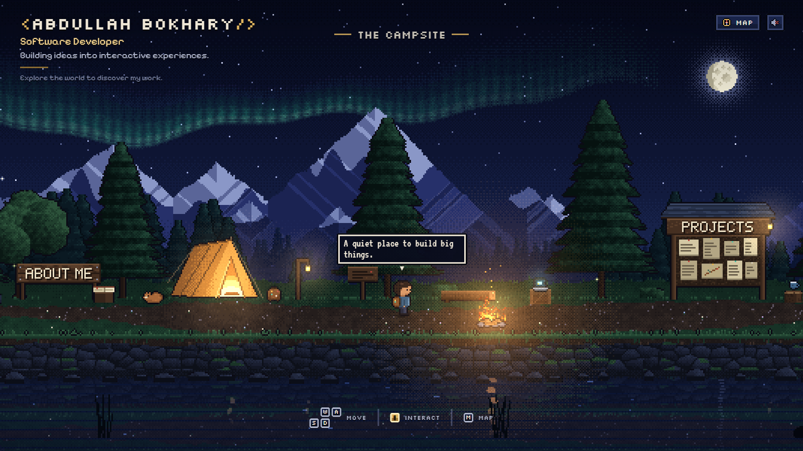
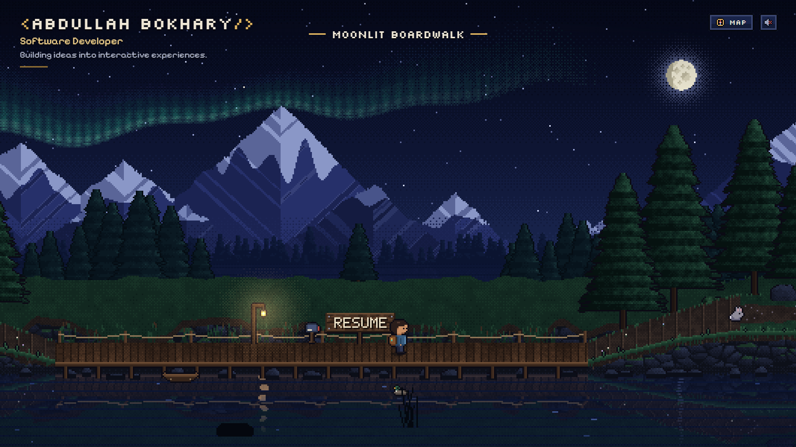
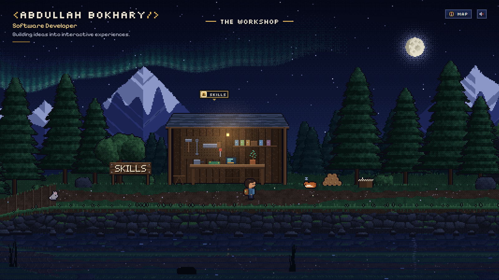
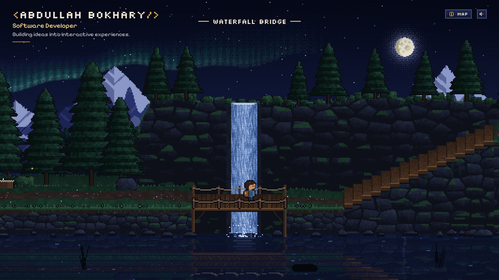
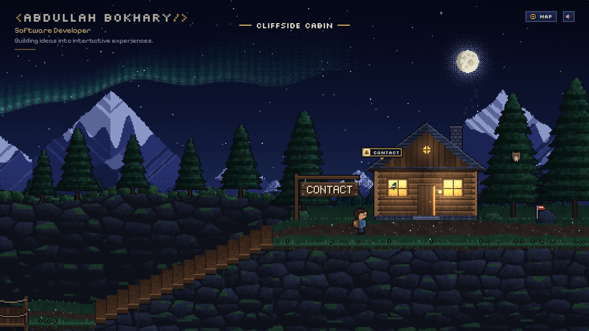
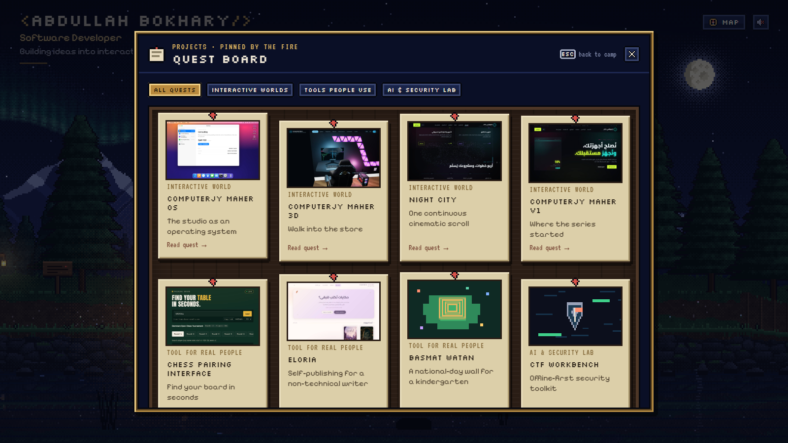
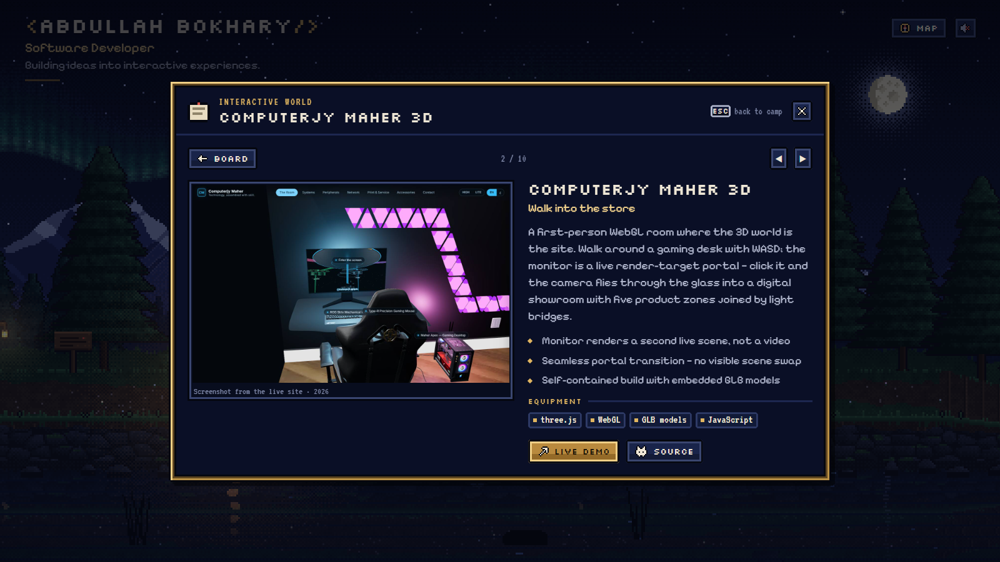
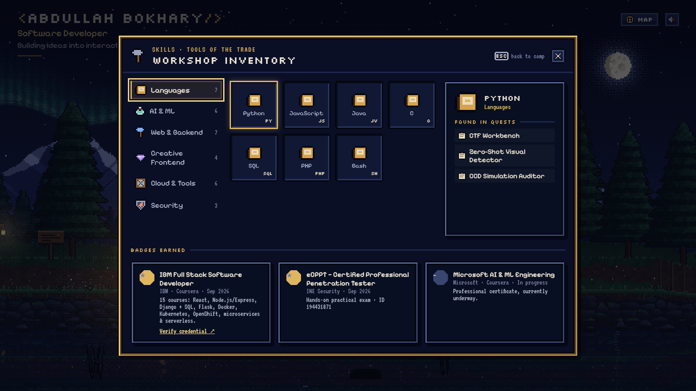
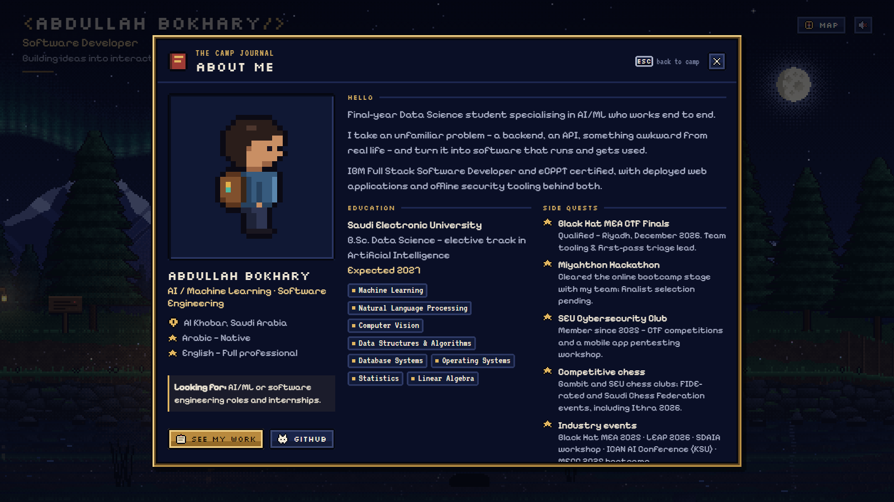
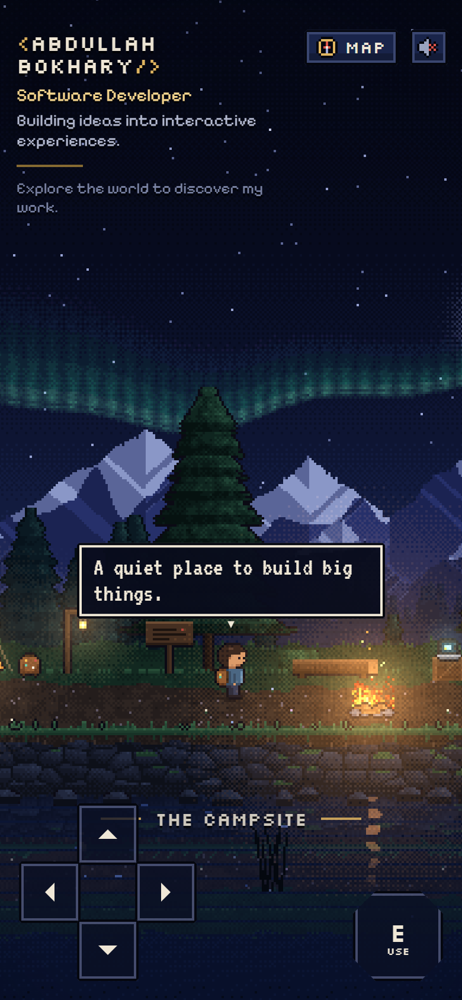

# Pixel Portfolio — a quiet place to build big things

A developer portfolio that is a small, playable pixel-art world: a campsite in the woods at night.
There are no page sections — you walk a little character around, and the portfolio is the things you find.

**Live:** https://abdullah2036.github.io/pixelportfolio/



## Controls

| | |
|---|---|
| **WASD / arrow keys** | walk (hold **Shift** to run) |
| **E** / Enter / Space | interact |
| **Esc** | close a panel or dialogue |
| **M** | map — pick a place and the camera carries you there |
| **1 – 5** | jump to About, Projects, Skills, Resume, Contact |
| **Touch** | on-screen D-pad + interact button, or tap anywhere to walk there |

## The world

| Where | What you find |
|---|---|
| The campsite | **About me** (sign + journal), the **Projects** quest board, a glowing tent, the campfire, a laptop, a sleeping cat |
| Moonlit boardwalk | the **Resume** in the dock mailbox, a rowboat, a duck, *"same sky, bigger dreams"* |
| The workshop | **Skills** as an RPG inventory, a sleeping fox, a chess game in progress |
| Waterfall bridge | the waterfall, and stairs up the cliff |
| Cliffside cabin | **Contact** — the lights are on, and there's a tiny terminal in the window |

| | |
|---|---|
|  |  |
|  |  |

### Panels

| | |
|---|---|
|  |  |
|  |  |

### On a phone



The phone layout isn't a shrunken desktop: the view turns into a tall portrait scene and the touch controls sit over the lake.

## Run it

```bash
npm install
npm run dev        # http://localhost:5173
npm run build      # static site in dist/
npm run preview
```

Needs Node 20.19+ or 22.12+.

## Deploy

Every push to `main` builds the site and publishes it to GitHub Pages
([`.github/workflows/deploy.yml`](.github/workflows/deploy.yml)).
One-time setup: **Settings → Pages → Build and deployment → Source: GitHub Actions**.

The build uses relative paths (`base: './'`), so `dist/` also works as-is on Cloudflare Pages, Netlify or any static host.

**Editing from any device:** press `.` on the repo page to open it in github.dev, edit
`src/data/portfolio.ts`, and commit — the site redeploys by itself. For a full dev server in the
browser, use **Code → Codespaces**.

## Edit the content

Everything a visitor reads is in **[`src/data/portfolio.ts`](src/data/portfolio.ts)**: name, bio,
education, achievements, links, certifications, projects and skills. No game code depends on the wording.

- **Projects** — `image` is a path under `public/` (screenshots are in `public/assets/projects/`).
  Leave it out and the quest board draws a pixel illustration chosen by `art`.
- **Skills** — grouped into "bags"; `usedIn` links an item to project ids ("found in quests").
- **Resume** — replace `public/assets/resume/Abdullah_Bokhary_Resume.pdf`, or change `links.resume`.
- **Phone** — `links.phone` is empty on purpose; fill it in if you want it on the contact panel.
- **World text** (thought bubbles, object dialogue) — `worldText` at the bottom of the same file.

Where things stand in the world is level design, in [`src/game/world/layout.ts`](src/game/world/layout.ts).

## Replace the art

All sprites and backgrounds are generated in code when the page loads, so the site ships with no
image files for the world. To use hand-made pixel art, drop PNGs into `public/assets/…` and point
to them in **[`src/game/assets.ts`](src/game/assets.ts)** (`ASSET_OVERRIDES`). Anything left `null`
stays procedural.

- Draw at 1× (world pixels); the engine picks an integer scale for the screen.
- Objects are anchored bottom-centre on their spot in `layout.ts`.
- Player sheet: one row per animation (idle, walk), frames left → right, facing right.

## Audio

Nothing plays until the visitor clicks the speaker. The ambience — crickets, wind, the lake, a
waterfall and campfire that get louder as you walk closer, a distant owl — and a slow lo-fi loop are
synthesised live with the Web Audio API, so there are no audio files. To use recordings instead, set
`ASSET_OVERRIDES.audio.nature` / `.music` to looping files in `public/assets/audio/`.

## How it's built

React + Vite + TypeScript on a plain 2D canvas — no game engine.

```
src/
  data/portfolio.ts          all personal content
  game/
    config.ts                world size, speeds, camera, parallax
    assets.ts                optional PNG / audio overrides
    world/terrain.ts         the walkable path (front edge + depth band, stepped stairs)
    world/layout.ts          props, interactions, zones, thoughts
    engine/GameEngine.ts     loop, camera, render pipeline, interaction, travel
    engine/Scene.ts          builds layers, props, animals, lights
    engine/Player.ts         movement, walking around the fire, animation
    engine/Critters.ts       cat, fox, owl, rabbit, duck
    engine/Input.ts          keyboard + touch input
    render/pixel.ts          pixel buffers, dithering, noise, ASCII-grid sprites
    render/font.ts           5×7 bitmap font for the signs
    render/palette.ts        colour ramps
    render/sprites/          hand-authored characters and props
    render/generators/       sky + aurora, mountains, forests, terrain, trees, fire, water
  components/                HUD, prompts, thought bubble, map, sound, touch pad, dialogue
  components/panels/         About, Quest board, Skills, Contact, Resume
  audio/AudioEngine.ts       Web Audio ambience + lo-fi (loaded on first click)
  state/store.ts             small shared store between the canvas and React
```

The world renders into a small frame buffer (about 480×270 on a 16:9 screen) that is upscaled with
nearest-neighbour sampling, with a sub-pixel camera offset so scrolling stays smooth. Static layers
are baked once; each frame draws the parallax layers, the lake with rippled reflections and light
streaks, y-sorted props and animals, and dithered additive glows — about 2 ms of CPU per frame.

**Accessibility:** the map reaches every section without playing, panels are focus-trapped dialogs
that close on Esc, reduced motion is respected, and a plain-text summary is available to screen readers.

---

Built by [Abdullah Bokhary](https://www.linkedin.com/in/abdullah-bokhary-840315326/) ·
[GitHub](https://github.com/abdullah2036) · [Email](mailto:bukhariabdulla77@gmail.com)
